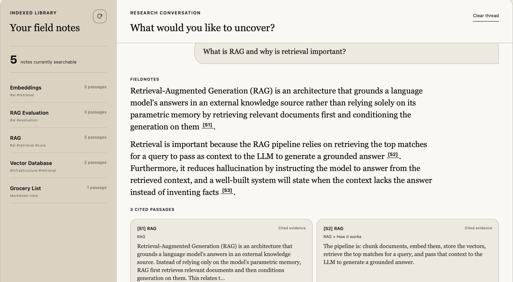

# Obsidian Vault RAG Knowledge Assistant

A production-quality **RAG** (Retrieval-Augmented Generation) application that lets
you ask natural-language questions about your personal **Obsidian** Markdown
vault and get **grounded answers with source attribution**.

It is built to demonstrate the RAG fundamentals end-to-end — structure-aware
chunking, asymmetric embeddings, a vector store, a relevance-gated retriever,
grounded generation, reliable no-answer behaviour, and evaluation — not to be a
generic "chat with documents" demo.

---

## Product preview



*A grounded answer with traceable evidence from the indexed Obsidian vault.*

---

## Problem statement

Notes in an Obsidian vault hold real knowledge, but that knowledge is inert:
you can only find things you remember writing. A naive "dump everything into an
LLM" approach hallucinates, loses the connection to the original note, and
cannot say "I don't know." This project retrieves the *relevant* notes for a
question, grounds the answer in them, cites them, and **declines when the vault
doesn't contain the answer**.

## Core design principle

```
RETRIEVE  →  SELECT / VERIFY  →  GENERATE  →  CITE
```

not

```
QUESTION  →  LLM  →  ANSWER
```

The **relevance gate runs before the LLM**. If nothing clears the threshold, the
API returns a fixed no-answer message and **never calls Gemini** — so
hallucination on empty retrieval is structurally impossible, not just
discouraged by the prompt.

## Architecture

See [docs/architecture.md](docs/architecture.md) for the full Mermaid diagram
and layer table.

```
Vault → Loader → Parser → Chunker → Embeddings → ChromaDB
                                                     │
Question → (condense) → Query embedding → Vector search → Gate + diversify
                                                     │
                              grounded? ── no ──→ No-answer (LLM skipped)
                                   │ yes
                                   └──→ Gemini (grounded, cited) → Answer + Sources
```

The **embedding model**, the **vector database**, and the **LLM** are three
separate interfaces and are never conflated.

## Technology choices

| Concern | Choice | Why |
|--------|--------|-----|
| API | FastAPI + Pydantic | Typed, self-documenting (`/docs`), async-ready, Vercel-friendly |
| Embeddings | `gemini-embedding-001` | Current GA Gemini embedding model; asymmetric `RETRIEVAL_DOCUMENT`/`RETRIEVAL_QUERY` task types improve retrieval quality; Matryoshka dimensions |
| LLM | `gemini-3.7-flash` | Latest stable Gemini Flash model for grounded synthesis |
| Vector store | ChromaDB (`PersistentClient`, cosine) | Lightweight, persistent, metadata filtering; ideal for a local RAG prototype |
| Markdown | Custom Obsidian-aware parser | Preserves headings/sections/code, extracts tags + `[[wikilinks]]` |

**Offline mode:** with no `GEMINI_API_KEY`, the app transparently uses a
deterministic **fake embedder** and **fake LLM** so the entire pipeline — including
retrieval and no-answer behaviour — runs and is fully testable without
credentials or network. The active providers are always reported by `/health`.

## Project structure

```
app/
├── api/           # FastAPI routes + dependency wiring
├── core/          # config, logging, exceptions
├── models/        # domain dataclasses + API schemas
├── ingestion/     # vault loading (path-guarded) + ingest pipeline
├── parsing/       # Obsidian Markdown parsing
├── chunking/      # structure-aware chunker
├── embeddings/    # EmbeddingProvider interface + Gemini/fake impls
├── vectorstore/   # ChromaDB wrapper
├── retrieval/     # query embedding, relevance gate, diversity
├── generation/    # prompt, query condensation, LLM, answer service
└── main.py        # app composition
frontend/           # dependency-free editorial chat interface
scripts/ingest.py  # CLI / build-time ingestion
eval/              # labelled dataset + evaluation harness
sample_vault/      # interlinked engineering knowledge base
docs/              # architecture + deployment notes
```

---

## Local setup

Requires Python 3.11+.

```bash
python3 -m venv .venv
source .venv/bin/activate
pip install -r requirements.txt
cp .env.example .env                      # optional; add GEMINI_API_KEY for real answers
```

### Environment variables

All configuration is environment-driven (see `.env.example`). Key ones:

| Variable | Default | Meaning |
|----------|---------|---------|
| `GEMINI_API_KEY` | *(empty)* | Google AI Studio key. Empty ⇒ offline fake providers. |
| `EMBEDDING_MODEL` | `gemini-embedding-001` | Embedding model. |
| `EMBEDDING_DIMENSIONS` | `768` | Truncated embedding size (Matryoshka). |
| `LLM_MODEL` | `gemini-3.7-flash` | Generation model. |
| `VAULT_DIR` | `./sample_vault` | Vault root; also the filesystem access boundary. |
| `CHUNK_SIZE` / `CHUNK_OVERLAP` | `1400` / `200` | Chunking (characters). |
| `CHROMA_DIR` | `./.chroma` | Vector store persistence dir. |
| `TOP_K` | `6` | Chunks passed to the LLM. |
| `RELEVANCE_THRESHOLD` | *(provider default)* | Gate; empty ⇒ provider's recommended value. |
| `MAX_CHUNKS_PER_NOTE` | `3` | Per-note diversity cap. |

Secrets are never hardcoded and never logged.

---

## Running

### 1. Ingest the vault

```bash
python -m scripts.ingest                 # incremental; only changed notes re-embedded
python -m scripts.ingest --force         # full rebuild
python -m scripts.ingest --vault /path/to/your/vault
```

### 2. Start the API

```bash
uvicorn app.main:app --reload
```

Open interactive docs at **http://localhost:8000/docs**.
Open the knowledge assistant at **http://localhost:8000/**.

### 3. Query

```bash
curl -s localhost:8000/health

curl -s localhost:8000/ingest -X POST -H 'content-type: application/json' -d '{}'

curl -s localhost:8000/query -X POST -H 'content-type: application/json' \
  -d '{"question":"What metrics did I mention for evaluating RAG?","top_k":4}'

curl -s localhost:8000/sources
```

Example `/query` response:

```json
{
  "answer": "You track retrieval relevance, source correctness, answer faithfulness, and answer relevance [S1].",
  "grounded": true,
  "sources": [
    {"source": "RAG Evaluation.md", "title": "RAG Evaluation", "section": "RAG Evaluation > Metrics",
     "path": "concepts/RAG Evaluation.md", "relevance": 0.83, "snippet": "..."}
  ],
  "query_used": "What metrics did I mention for evaluating RAG?",
  "model": "gemini-3.7-flash"
}
```

## API

| Method | Path | Purpose |
|--------|------|---------|
| `GET` | `/health` | Status + active providers + indexed chunk count |
| `POST` | `/ingest` | Ingest/refresh a vault (`{vault_path?, force?}`) |
| `POST` | `/query` | Ask a question (`{question, history?, top_k?, threshold?, tag?}`) |
| `GET` | `/sources` | List indexed notes with chunk counts |

**Conversation memory:** `/query` accepts a `history` array; follow-up questions
are condensed into a standalone query before retrieval (kept deliberately simple
— no server-side session store in the MVP).

## Ingestion flow

1. Recursively discover `.md`/`.markdown` files (skipping `.obsidian`, `.git`,
   `node_modules`, empty and oversized files).
2. Parse frontmatter, structural blocks, `#tags`, and `[[wikilinks]]`.
3. Chunk **within section boundaries** (never mixing sections; code fences kept
   whole), carrying the heading breadcrumb into each chunk's embedded text.
4. Embed with `RETRIEVAL_DOCUMENT` task type; upsert into ChromaDB under stable
   ids.
5. **Incremental:** a per-note SHA-256 content hash skips unchanged notes so
   nothing is re-embedded needlessly.

## Retrieval flow

1. (If follow-up) condense question using recent history.
2. Embed the query with `RETRIEVAL_QUERY` task type.
3. Oversample candidates (`top_k × candidate_multiplier`).
4. **Gate** by relevance threshold → this is what enables reliable no-answer.
5. **Diversify** (cap chunks per note), trim to `top_k`.
6. Build a numbered-source prompt; Gemini answers grounded with `[S#]` citations.

## Evaluation

A labelled set lives in [eval/dataset.json](eval/dataset.json); the transparent
harness in [eval/evaluate.py](eval/evaluate.py) measures **retrieval recall@k**,
**top-source accuracy**, **context-term coverage**, and **no-answer accuracy**.
It evaluates retrieval directly, so repeated runs do not spend LLM generation
quota or mislabel citation presence as claim-level faithfulness.

```bash
python -m eval.evaluate
```

Latest verified live baseline (Gemini embeddings, 2026-08-28): **100%**
retrieval recall@k, top-source accuracy, context-term coverage, and no-answer
accuracy across 15 labelled cases (12 answerable, 3 negative). The 12-note demo
vault produces 40 structure-aware chunks. This is an integration baseline, not
a claim of production accuracy on arbitrary vaults.

> **Honest note:** run **offline**, source-correctness is imperfect because the
> deterministic fake embedder is a weak bag-of-words stand-in — this is shown,
> not hidden. Real Gemini results should be recorded before changing retrieval
> thresholds. The point of the harness is that the system is *measured*, not
> assumed accurate.

## Security

- The vault directory is a hard filesystem boundary: every path is resolved and
  asserted to live inside it (path-traversal test enforces this).
- Markdown is treated as untrusted **data** — never executed.
- Secrets come from the environment and are never logged.

## Limitations

- Fake providers are for plumbing/tests, not production retrieval quality.
- Conversation memory is stateless (client passes history); no persistence.
- Wikilinks are captured in metadata but not yet used to expand retrieval.
- ChromaDB `PersistentClient` is single-node (see deployment notes).

## Future improvements

- **Wikilink-aware retrieval:** expand context along `[[links]]` from top hits.
- Hybrid retrieval (BM25 + dense) and a cross-encoder reranker.
- Server-side sessions for multi-turn memory.
- Streaming responses; citation span highlighting.

## Deployment

### Streamlit Community Cloud (recommended free demo)

The repository includes a single-app Streamlit entrypoint at
`streamlit_app.py`. It reuses the same ingestion, retrieval, grounding and
citation pipeline as the API. Follow the [Streamlit deployment guide](docs/deployment-streamlit.md)
and add `GEMINI_API_KEY` in Streamlit secrets—never commit a local `.env` file.

### FastAPI / Vercel

See [docs/deployment-vercel.md](docs/deployment-vercel.md). Summary: the app is
Vercel-compatible, but ChromaDB's on-disk persistence is not serverless-durable
and ingestion is too long for a request handler. Recommended production path —
run ingestion as a build/offline job and swap the single `ChromaStore` seam to
a managed vector store (Chroma Cloud / Qdrant / Pinecone). No component is
silently replaced.

## Frontend

The same FastAPI process serves a responsive, dependency-free interface at `/`.
It includes live provider health, indexed-source browsing, incremental re-ingest,
multi-turn questions, grounded/no-answer states, and clickable `[S#]` citation
cards. The visual system follows the warm parchment, editorial serif/sans, and
single-clay-accent direction documented in
[docs/frontend-style-reference.md](docs/frontend-style-reference.md).
