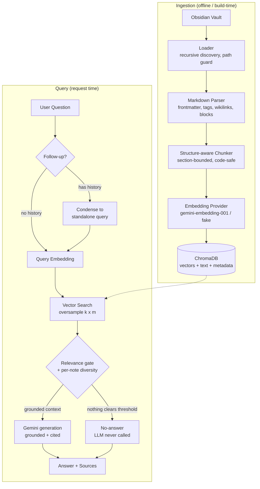

# Architecture

## RAG pipeline

## Design principle: RETRIEVE → SELECT → GENERATE → CITE

The relevance gate sits **before** the LLM. When no chunk clears the threshold,
the API returns the fixed no-answer message without ever calling Gemini, so
hallucination on empty retrieval is structurally impossible rather than merely
discouraged by prompt wording.

## Layered responsibilities

| Layer | Package | Responsibility |
|-------|---------|----------------|
| Ingestion | `app/ingestion` | Discover + safely load notes; orchestrate ingest |
| Parsing | `app/parsing` | Obsidian Markdown → frontmatter, blocks, tags, wikilinks |
| Chunking | `app/chunking` | Section-aware packing with overlap |
| Embeddings | `app/embeddings` | `EmbeddingProvider` interface + Gemini/fake impls |
| Vector store | `app/vectorstore` | ChromaDB: upsert, query, incremental hashes |
| Retrieval | `app/retrieval` | Embed query, gate, diversify |
| Generation | `app/generation` | Prompt, condensation, Gemini/fake LLM, answer service |
| API | `app/api` | FastAPI routes + dependency wiring |
| Models | `app/models` | Domain dataclasses + API schemas |

The embedding model, the vector database, and the LLM are three separate
interfaces — never conflated. Chroma never calls an embedding model; we supply
vectors explicitly so the provider stays swappable.
